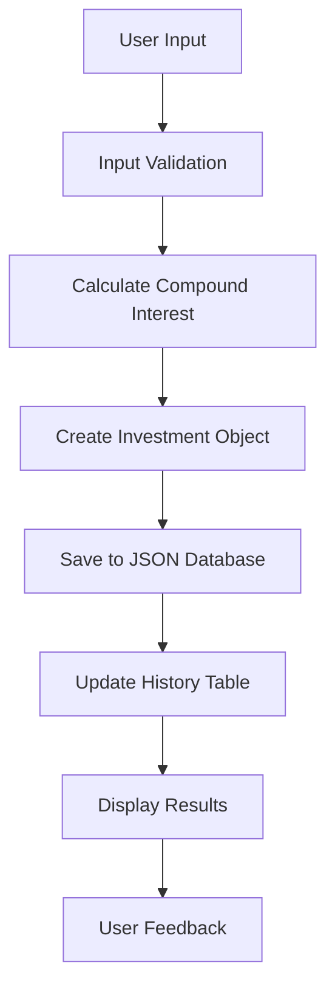

# 💰 Kalkulator Investasi

<div align="center">


**Aplikasi kalkulator investasi canggih dengan GUI modern dan sistem penyimpanan history**

[Fitur](#-fitur-unggulan) • [Instalasi](#-instalasi) • [Penggunaan](#-penggunaan)

</div>

## 📋 Daftar Isi

- [Gambaran Umum](#-gambaran-umum)
- [Fitur Unggulan](#-fitur-unggulan)
- [Instalasi](#-instalasi)
- [Penggunaan](#-penggunaan)
- [Dokumentasi Teknis](#-dokumentasi-teknis)
- [Contoh Perhitungan](#-contoh-perhitungan)
- [FAQ](#-faq)

## 🚀 Gambaran Umum

**Super Kalkulator Investasi Bunga Majemuk** adalah aplikasi desktop canggih yang dirancang untuk membantu Anda merencanakan dan menganalisis investasi dengan sistem bunga majemuk. Aplikasi ini menawarkan antarmuka yang intuitif, perhitungan yang akurat, dan sistem penyimpanan data yang robust.

### ✨ Highlights

- 🎨 **GUI Modern** dengan gradient background dan styling profesional
- 💾 **Penyimpanan Otomatis** riwayat perhitungan dalam format JSON
- 📊 **Tabel Riwayat** dengan sorting dan format currency
- 🧮 **Perhitungan Akurat** menggunakan rumus bunga majemuk
- 🚀 **Multi-tab Interface** untuk pengalaman pengguna yang optimal
- 💰 **Format Currency** dengan separator ribuan

## 🌟 Fitur Unggulan

### 💡 Core Features
- **Kalkulator Bunga Majemuk** - Perhitungan investasi yang presisi
- **Real-time Calculation** - Hasil langsung tanpa delay
- **Input Validation** - Validasi otomatis untuk data yang akurat
- **Error Handling** - Penanganan error yang user-friendly

### 📈 Data Management
- **Auto-save History** - Setiap perhitungan langsung tersimpan
- **JSON Storage** - Format penyimpanan terstruktur dan readable
- **Persistent Data** - Data tetap aman meski aplikasi ditutup
- **Clear History** - Opsi untuk menghapus riwayat lengkap

### 🎨 UI/UX Features
- **Modern Dark Theme** - Tema gelap yang eye-friendly
- **Responsive Design** - Adaptif untuk berbagai ukuran layar
- **Professional Styling** - Button hover effects, rounded corners
- **Tab Navigation** - Organisasi fitur yang intuitif
- **Visual Feedback** - Status dan hasil yang jelas

### 🔧 Utility Features
- **Format Ribuan** - Tampilan angka dengan separator
- **Copy Result** - Mudah menyalin hasil perhitungan
- **Reset Input** - Bersihkan form dengan satu klik
- **Export Ready** - Struktur data siap untuk ekspor

## 📥 Instalasi

### Prerequisites

- Python 3.7 atau lebih tinggi
- pip (Python package manager)
- PyQt5 library

### Step-by-Step Installation

1. **Download Project**
   ```bash
   git clone https://github.com/username/super-investment-calculator.git
   cd super-investment-calculator
   ```

2. **Buat Virtual Environment (Recommended)**
   ```bash
   python -m venv investasi_env
   # Windows
   investasi_env\Scripts\activate
   # Linux/Mac
   source investasi_env/bin/activate
   ```

3. **Install Dependencies**
   ```bash
   pip install PyQt5
   ```

4. **Verifikasi Instalasi**
   ```bash
   python main.py
   ```

### Quick Install (Windows)
```bash
# Download semua file ke satu folder
python main.py
```

### Requirements File
```txt
PyQt5>=5.15.0
```

## 🎮 Penggunaan

### Menjalankan Aplikasi

```bash
python main.py
```

### Basic Usage Flow

1. **Buka Tab Kalkulator**
   - Isi modal awal (contoh: 10000000)
   - Masukkan bunga tahunan (contoh: 8.5)
   - Tentukan jangka waktu (contoh: 5)
   - Klik "🚀 Hitung Investasi"

2. **Lihat Hasil**
   - Hasil akan muncul di bagian bawah
   - Data otomatis tersimpan ke history

3. **Cek Riwayat**
   - Pindah ke tab "📊 Riwayat"
   - Lihat semua perhitungan sebelumnya
   - Data tersortir dari terbaru

### Input Format

| Field | Format | Contoh |
|-------|--------|---------|
| Modal Awal | Angka (tanpa titik) | `10000000` |
| Bunga | Angka desimal | `8.5` |
| Tahun | Angka bulat | `5` |

### Keyboard Shortcuts

| Shortcut | Action |
|----------|--------|
| `Enter` | Hitung investasi (di input field) |
| `Ctrl + Q` | Keluar aplikasi |
| `Tab` | Navigasi antar field |

## 📚 Dokumentasi Teknis

### Architecture Overview

### Workflow Diagram



### Rumus Matematika

**Bunga Majemuk:**
```
A = P × (1 + r)^t

Dimana:
A = Nilai akhir investasi
P = Modal awal (Principal)
r = Tingkat bunga per tahun (dalam desimal)
t = Jangka waktu (tahun)
```


### File Descriptions

| File | Description |
|------|-------------|
| `main.py` | Entry point aplikasi, inisialisasi main window |
| `widgets.py` | Semua komponen GUI dan tab management |
| `database.py` | Manajemen CRUD operations untuk data investasi |
| `models.py` | Data classes dan business logic |
| `styles.py` | CSS-like styling untuk seluruh aplikasi |
| `history_investasi.json` | Auto-generated database file |


## 💡 Contoh Perhitungan

### Basic Calculation Example

**Input:**
- Modal Awal: Rp 10,000,000
- Bunga: 8.5% per tahun
- Jangka Waktu: 5 tahun

**Perhitungan:**
```
A = 10,000,000 × (1 + 0.085)^5
A = 10,000,000 × (1.085)^5
A = 10,000,000 × 1.503
A = Rp 15,030,000
```

**Output di Aplikasi:**
```
💰 Hasil Investasi setelah 5 tahun:
Rp 15.030.000,00
```

### Advanced Examples

| Modal | Bunga | Tahun | Hasil |
|-------|-------|-------|-------|
| Rp 5,000,000 | 7% | 10 | Rp 9,835,760 |
| Rp 20,000,000 | 6.5% | 15 | Rp 51,362,120 |
| Rp 50,000,000 | 9% | 20 | Rp 280,220,190 |

## ❓ FAQ

### Q: Apakah data saya aman?
**A:** Ya, data disimpan lokal di file JSON di komputer Anda. Tidak ada data yang dikirim ke server eksternal.

### Q: Bisakah menghitung bunga bulanan?
**A:** Saat ini hanya support bunga tahunan, namun mudah dikembangkan untuk periode bulanan.

### Q: Bagaimana cara backup data?
**A:** Cukup backup file `history_investasi.json` di folder aplikasi.

### Q: Apakah bisa import data dari Excel?
**A:** Fitur import/export Excel bisa ditambahkan di versi mendatang.

### Q: Bagaimana reset aplikasi ke pengaturan default?
**A:** Hapus file `history_investasi.json` dan restart aplikasi.

### Q: Apakah support multiple currency?
**A:** Saat ini hanya Rupiah, tapi format angka bisa diadaptasi untuk currency lain.

### Q: Bisakah diintegrasikan dengan database external?
**A:** Ya, architecture sudah modular dan bisa diintegrasikan dengan SQLite/MySQL.

## 🐛 Troubleshooting

### Common Issues

1. **ModuleNotFoundError: No module named 'PyQt5'**
   ```bash
   pip install PyQt5
   ```

2. **Aplikasi tidak bisa dibuka**
   - Pastikan Python 3.7+ terinstall
   - Check virtual environment aktif

3. **History tidak tersimpan**
   - Check permission folder
   - Pastikan tidak ada aplikasi lain yang membuka file JSON

### Debug Mode

```python
# Tambahkan di main.py untuk debug
import logging
logging.basicConfig(level=logging.DEBUG)
```

## 📞 Support & Community

### Getting Help

1. **Baca Dokumentasi** - Dokumentasi lengkap tersedia di README ini
2. **Check Issues** - Lihat issue yang sudah ada di GitHub
3. **Buat Issue Baru** - Untuk bug report dan feature request
4. **Community Forum** - Diskusi dengan developer lain

### Resources

- 📚 **Documentation**: [Link ke Wiki]
- 🐛 **Bug Reports**: [GitHub Issues]
- 💡 **Feature Requests**: [GitHub Discussions]
- 👥 **Community**: [Discord/Forum Link]

## 🏆 Credits & Acknowledgments

### Built With
- **Python 3** - Programming language
- **PyQt5** - GUI framework
- **JSON** - Data storage format
- **Dataclasses** - Data modeling

### Special Thanks
- Developer community untuk feedback dan testing
- Contributors untuk fitur-fitur tambahan
- Users untuk bug reports dan suggestions

### Sponsors
[Your Company/Organization Name] - Untuk dukungan dan resources

---

<div align="center">

## ⭐ Support Project Ini!

Jika aplikasi ini membantu Anda, pertimbangkan untuk memberikan bintang di GitHub!

**"Plan your financial future with confidence"** 💫

[Kembali ke Atas](#-kalkulator-investasi)

</div>